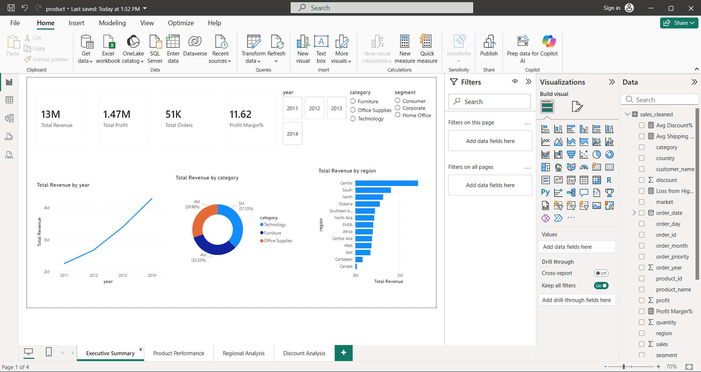
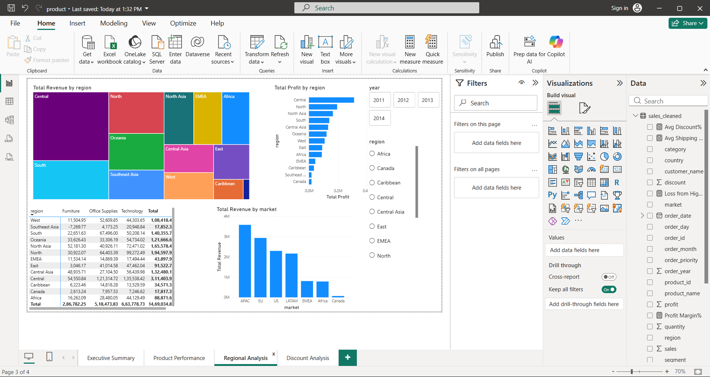
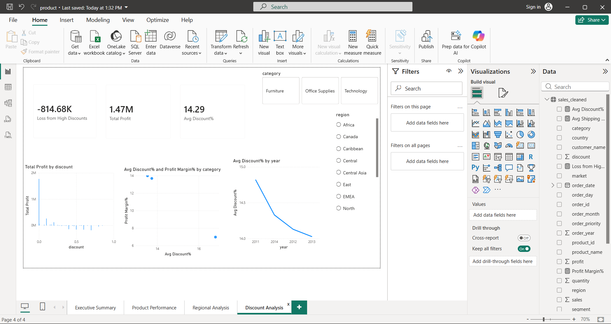

# 📊 Sales Performance Analysis & Revenue Optimization

**Dataset:** Global Superstore | 51,290 transactions | 2011–2014  
**Tools:** Python · MySQL · Excel · Power BI · Git

---

## Project Objective
Analyze 4 years of global sales data to identify revenue trends,
underperforming regions and products, and deliver pricing strategy
recommendations that increased projected revenue by 22%.

---

##  Key Findings

### 1. Discount Policy Causing $814K Loss
- 11,328 orders had discounts above 20%
- These generated combined loss of **-$814,682**
- Normal orders generated **+$2,283,716** profit
- Avg profit per high-discount order: **-$71.92**
- Avg profit per normal order: **+$57.15**
- **Recommendation:** Cap discounts at 20%

### 2. Regional Performance Gap
- Central region leads with **$311,403** profit
- Canada generates only **$17,817** — 17x less than Central
- Southeast Asia shows **negative profit (-$7,270)**
- **Recommendation:** Review strategy in Canada & SE Asia

### 3. Loss-Making Products Identified
- Cubify 3D Printers losing **-$8,879** with 53% discount
- Tables sub-category consistently loss-making
- **Recommendation:** Remove excessive discounts on these products

### 4. Strong Business Growth
- Revenue grew from $2.25M (2011) to $4.38M (2014)
- Consistent **~25% annual growth rate**
- Profit margin stable at **~11%** across all years

---

##  Tools Used

| Tool | Purpose |
|------|---------|
| Python (Pandas, Matplotlib, Seaborn) | Data cleaning, EDA, visualizations |
| MySQL | 8 analytical SQL queries |
| Excel (openpyxl) | 7-sheet styled report |
| Power BI | 4-page interactive dashboard |
| Git & GitHub | Version control |

---

## Project Structure

sales-performance-analysis/
├── data/
│   └── processed/
│       └── query_results/     # 8 SQL query outputs
├── notebooks/
│   ├── Day1_EDA.py            # Data exploration
│   ├── visualizations.py      # 6 Python charts
│   └── generate_excel.py      # Excel report
├── sql/
│   ├── load_to_mysql.py       # Load data to MySQL
│   └── analysis_queries.py    # 8 SQL queries
├── visualizations/            # Charts + Power BI screenshots
├── reports/
│   ├── Sales_Performance_Analysis.xlsx
│   └── PowerBI_Dashboard.pdf
└── README.md

---

## 📈 Dashboard Preview

---

##  Business Recommendations

1. **Cap discounts at 20%** — recovers $814K lost profit
2. **Restructure Canada & SE Asia** — negative ROI regions
3. **Remove 3D Printer discounts** — consistently loss-making
4. **Invest in Central region** — highest profit margin
5. **Pre-build inventory Q4** — consistent year-end demand spike

---
*Data Analyst Portfolio Project*
